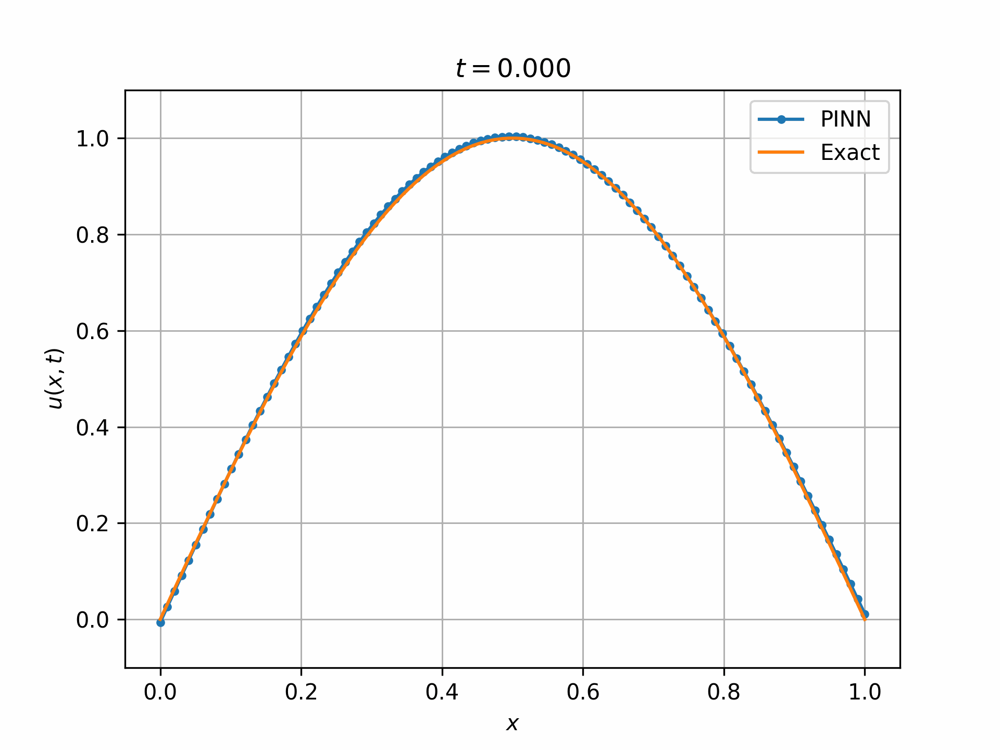

# Physics-Informed Neural Networks (PINNs) for Differential Equations

Physics-Informed Neural Networks (PINNs) are a class of deep learning models designed to solve differential equations by incorporating physical laws directly into the training process. Instead of relying solely on data, PINNs leverage the underlying mathematical structure of the problem, including ordinary differential equations (ODEs) and partial differential equations (PDEs), to guide the learning, incorporating initial and boundary conditions within the loss function. This makes them particularly effective for solving both forward problems (predicting the system’s behavior) and inverse problems (estimating unknown parameters from observed data).

---

## Mathematical Model

Suppose we want to solve a nonlinear partial differential equation:

$$
u_{t} + \mathcal{N}[u; \lambda] = 0, \qquad \text{where } x \in \Omega, \quad t \in [0, T],
$$

where $u(x,t)$ denotes the solution, $\mathcal{N}[·; \lambda]$ is a nonlinear operator parameterized by $\lambda$ and $\Omega$ is a subset of $\mathbb{R}^D$.

The Initial Conditions:

$$
u(x, 0) = u_0(x)
$$

and Boundary Conditions:

$$
\mathcal{B}[u; \lambda] = g(x, t), \qquad \text{where } x \in \partial \Omega, \quad t \in [0, T],
$$

$\mathcal{B}[·;\lambda]$ corresponds to boundary operators such as Dirichlet, Neumann, Robin, or periodic conditions.

The PINN approximates the solution $u(x,t)$ of the differential equation using a neural network $\hat{u}(x, t; \theta)$, where $\theta$ represents the network parameters. 

The network is trained to satisfy the governing differential equation (PDE), the Initial conditions (ICs), and the Boundary conditions (BCs).

By encoding these constraints into the loss function, the network learns a solution consistent with both the physics and any available data.

---

## Incorporation into the Loss Function

The neural network predicts $\hat{u}(x, t; \theta)$. Using automatic differentiation, the residual of the PDE is computed as:

$$
f(x, t) := \hat{u}_t + \mathcal{N}[\hat{u}; \lambda].
$$

### The PDE residual loss is then:

$$
L_{PDE} = \frac{1}{N_{PDE}} \sum_{i=1}^{N_{PDE}} \left| f(x^i, t^i) \right|^2,
$$

where $(x, t) \in \Omega \times [0, T]$.

### The Initial Conditions loss is then:

$$
L_{IC} = \frac{1}{N_{IC}} \sum_{i=1}^{N_{IC}} \left| \hat{u}(x^i, 0; \theta) - u_0(x^i) \right|^2,
$$

with $x \in \Omega$. 

### The Boundary Conditions loss term is:

$$
L_{BC} = \frac{1}{N_{BC}} \sum_{i=1}^{N_{BC}} \left| \hat{u}(x^i, t^i; \theta) - g(x^i, t^i) \right|^2,
$$

where $(x, t) \in \partial \Omega \times [0, T]$.

### Total Loss Function

The combined loss to minimize is:

$$
L(\theta, w) = w_{PDE} L_{PDE} + w_{IC} L_{IC} + w_{BC} L_{BC},
$$

where the $w$'s are weights balancing the terms.

---

## Inverse Problems

In inverse problems, unknown parameters or functions within the PDE are inferred by fitting the network not only to the physics but also to observed data points $\{ (x_d^i, t_d^i, u_d^i) \}$. The data mismatch term is added to the loss:

$$
L_{data} = \frac{1}{N_d} \sum_{i=1}^{N_d} \left| \hat{u}(x_d^i, t_d^i; \theta) - u_d^i \right|^2.
$$

### The total loss for inverse problems becomes:

$$
L(\theta, w) = w_{PDE} L_{PDE} + w_{IC} L_{IC} + w_{BC} L_{BC} + w_{data} L_{data}.
$$

Training optimizes both the neural network parameters $\theta$ and the unknown physical parameters, allowing simultaneous solution and parameter identification.

---

## Repository Structure

This repository contains Python implementations of Physics-Informed Neural Networks (PINNs) developed using **PyTorch**, specifically the `torch.nn` module.  

The `torch.nn` module provides the building blocks for defining and training neural networks in PyTorch.

In this project, we use:
- **Layers** — `nn.Linear` for fully connected layers forming the architecture of the PINN.
- **Activation functions** — (e.g. `nn.Tanh`,`nn.Sigmoid`) for introducing non-linearity into the network.
- **Loss functions** — `nn.MSELoss` (mean squared error) to measure the difference between predicted and target values.
- **Optimizers** — `torch.optim.Adam` for gradient-based optimization of the network parameters.
- Support for creating **custom models** by subclassing `nn.Module`.

This modular design makes it easy to define the PINN architecture as a sequence of fully connected layers with chosen activation functions, while allowing automatic differentiation to enforce the physics constraints.

In addition to PyTorch, the following libraries are used:
- **NumPy** — for efficient numerical operations and data handling.
- **Matplotlib** — for visualization of results, including animations.
- **time** — for handling timestamps in output files and logging.
- **math** — for retrieving the values of mathematical constants and performing basic operations outside of PyTorch tensors.
- **SciPy** — used in some examples to compute a high-accuracy *reference solution*, enabling comparison between the PINN prediction and the ground truth.

The PINNs solve both **ordinary differential equations (ODEs)** and **partial differential equations (PDEs)** in forward and inverse problems.

- **[GIFs](GIFs)** — Visualizations and animations illustrating the solutions obtained by the time-dependent PINNs.
- **[ODEs](ODEs)** — Examples of ODEs solved using PINNs.
- **[PDEs](PDEs)** — Examples of PDEs including the advection equation, heat equation, and shallow water equations.

<p align="center">
  
  <br>
  <em>Animation 1. Solution obtained by a PINN for the heat equation.</em>
</p>

As we can see in ***Animation 1***, the PINN successfully solves the **heat equation** in a forward problem setting. The resolution of this problem can be found [here](PDEs/Forward/heat.ipynb).

---

## Getting Started

### Dependencies Installation

You can install all required dependencies with:

```bash
pip install numpy==1.26.0 scipy==1.5.3 matplotlib==3.8.0 torch==2.1.1
```

## Bibliography

1. Raissi, M., Perdikaris, P., & Karniadakis, G. E. (2017).  
   *Physics Informed Deep Learning (Part I): Data-driven Solutions of Nonlinear Partial Differential Equations.*  
   arXiv:1711.10561. http://arxiv.org/abs/1711.10561

2. Raissi, M., Perdikaris, P., & Karniadakis, G. E. (2017).  
   *Physics Informed Deep Learning (Part II): Data-driven Discovery of Nonlinear Partial Differential Equations.*  
   arXiv:1711.10566. https://arxiv.org/abs/1711.10566

3. Wang, S., Wang, H., & Perdikaris, P. (2020).  
   *On the eigenvector bias of Fourier feature networks: From regression to solving multi-scale PDEs with physics-informed neural networks.*  
   arXiv:2012.10047. https://arxiv.org/abs/2012.10047

4. Jagtap, A. D., Kawaguchi, K., & Karniadakis, G. E. (2021).
   *Three Ways to Solve Partial Differential Equations with Neural Networks — A Review.*  
   arXiv:2102.11802. https://arxiv.org/abs/2102.11802

5. Wang, H., Lu, L., Song, S., & Huang, G. (2023).
   *Learning Specialized Activation Functions for Physics-Informed Neural Networks.*
   arXiv:2308.04073. https://arxiv.org/abs/2308.04073
